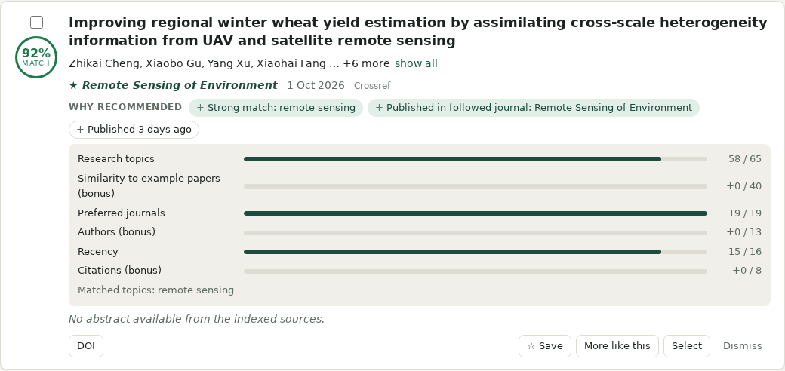
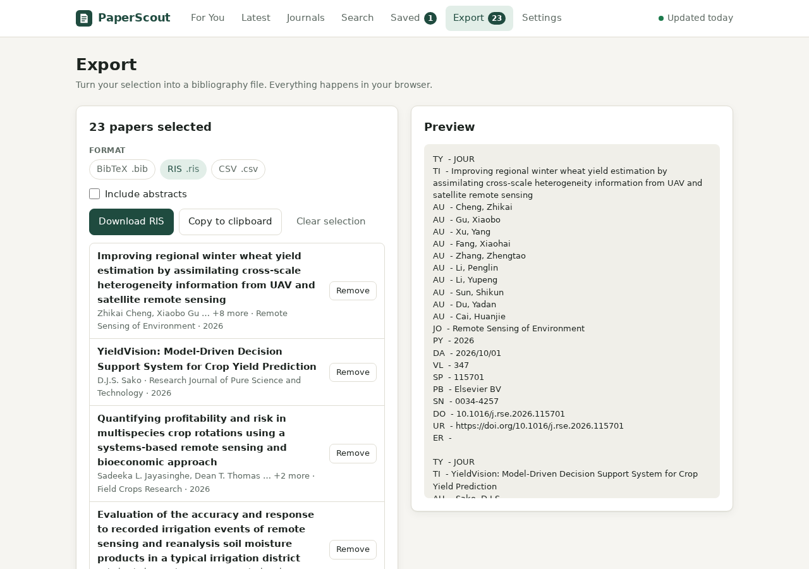
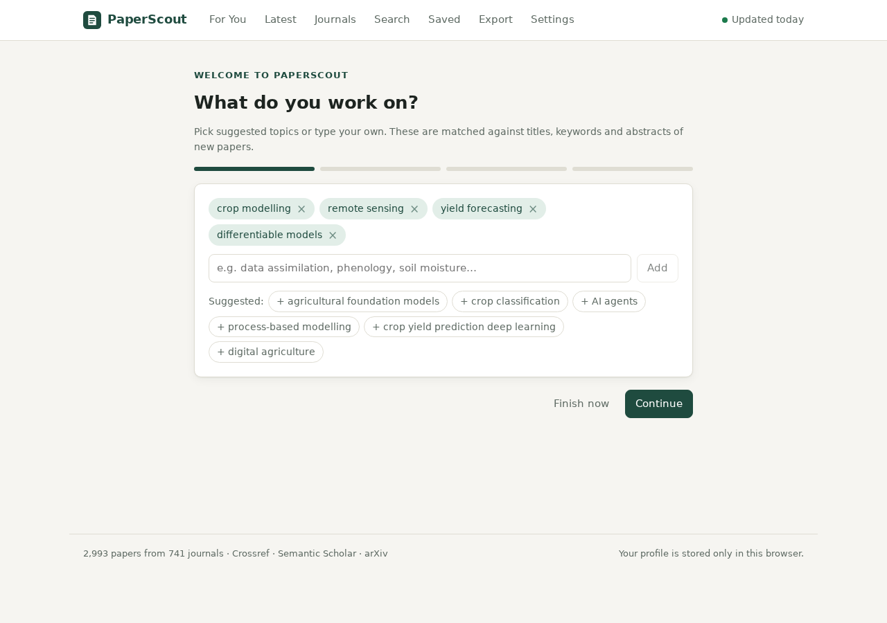
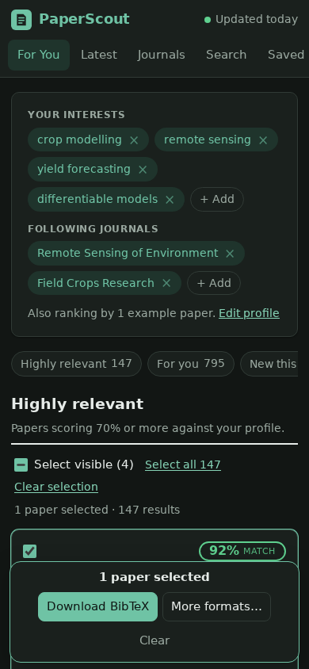

# PaperScout

A personalized feed of newly published scientific literature — hosted for free on GitHub Pages, updated every day by GitHub Actions.

Tell PaperScout your **research topics**, **preferred journals**, **example papers** and **authors**; it ranks new papers from **Web of Science, Crossref, Semantic Scholar and arXiv** against that profile, explains every recommendation, and exports any selection to **BibTeX** (or RIS / CSV).

- No server, no database, no paid APIs.
- API keys live only in GitHub Secrets and are used only inside GitHub Actions.
- Your profile stays in your browser (localStorage).

## Screenshots

| Dashboard | Why recommended |
|---|---|
|  |  |

| Export | Onboarding | Mobile (dark) |
|---|---|---|
|  |  |  |

## Features

- **Onboarding** — topics (suggested or free text), journals (search any journal via Crossref), example papers (by DOI, title or from the feed), authors.
- **For You dashboard** — Highly relevant · For you · New this week · From journals you follow · Trending · Related to saved papers.
- **Paper cards** — title, authors, journal, date, abstract, DOI, open-access/PDF link, Web of Science / Semantic Scholar / arXiv links, citations, source databases, match %, and the reasons behind the score with a per-signal breakdown.
- **Search** — title, keyword/topic, author, journal, DOI; quoted phrases; filters for date, journal, source, open access, document type, citations, relevance; sort by best match, relevance, newest or citations. One click extends a search to all of Crossref.
- **Selection** — checkboxes, select visible, select all, clear, a selection bar that follows you across pages.
- **Export** — BibTeX, RIS, CSV, generated and downloaded in the browser.
- **Saved papers**, **dismissed papers**, remembered filters, adjustable ranking weights, light/dark theme, profile backup/restore.

## Architecture

```text
Web of Science ┐
Crossref ──────┤  GitHub Actions (daily)                         GitHub Pages
Semantic Sch. ─┼─▶ fetch → normalize → dedupe/merge → enrich ─▶ public/data/*.json ─▶ React app
arXiv ─────────┘  (secrets from GitHub Secrets)                  (static)            ranks in the browser
```

The pipeline builds one shared catalogue of recent papers; each visitor's browser scores it against their own profile.
Full details, design decisions and extension points are in [ARCHITECTURE.md](ARCHITECTURE.md).

```text
.github/workflows/   update-papers.yml · deploy.yml · ci.yml
config/              pipeline.config.json   ← topics & journals the catalogue covers
scripts/             fetch-papers.ts        ← the pipeline (only place that reads secrets)
public/data/         papers.json · journals.json · last_updated.json   (generated)
src/types/           common Paper schema, user profile
src/services/        http client, source clients (sources/), catalogue loader
src/utils/           normalization, deduplication, filtering/search
src/recommendation/  ranking engine
src/export/          BibTeX · RIS · CSV
src/store/           profile persistence + React contexts
src/components/, src/pages/
tests/
```

## Quick start (deploy your own)

1. **Fork or push** this repository to GitHub. The default branch must be `main`.
2. **Enable Pages**: *Settings → Pages → Build and deployment → Source: **GitHub Actions***.
3. **Allow the workflow to commit**: *Settings → Actions → General → Workflow permissions → **Read and write permissions***.
4. *(Optional)* add secrets and variables — see [API keys](#api-keys-and-secrets).
5. **Edit [`config/pipeline.config.json`](config/pipeline.config.json)** with the topics and journals your catalogue should cover.
6. Run **Actions → Update papers → Run workflow**. It builds the catalogue, commits it, and deploys the site.
   After that it runs daily on its own.

The site is published at `https://<user>.github.io/<repository>/`. No base-path configuration is needed.

> The repository ships with a real catalogue generated on 2026-10-04 (Crossref, Semantic Scholar and arXiv), so the
> site works immediately after the first deploy.

## Local installation and development

Requires Node.js 20 or newer.

```bash
npm install
npm run dev            # http://localhost:5173
npm test               # unit tests (vitest)
npm run typecheck
npm run build          # type-check + production build into dist/
npm run preview        # serve the production build
```

Rebuild the catalogue locally:

```bash
cp .env.example .env   # optional: add keys; .env is git-ignored
npm run fetch-papers   # writes public/data/*.json
```

Without any keys the pipeline still runs with Crossref, arXiv and the public Semantic Scholar pool.

## GitHub Pages deployment

[`deploy.yml`](.github/workflows/deploy.yml) runs the tests, builds the site and publishes `dist/` with the official
Pages actions. It is triggered by pushes to `main`, manually, and by the update workflow after a new catalogue is
committed. The app uses hash-based routes and relative asset URLs, so it works under any path or custom domain.

## GitHub Actions configuration

| Workflow | Trigger | What it does |
|---|---|---|
| `update-papers.yml` | daily at 04:17 UTC, manual | runs the pipeline, commits `public/data/`, then calls `deploy.yml` |
| `deploy.yml` | push to `main`, manual, called | test → build → deploy to Pages |
| `ci.yml` | pull requests | test → build |

Change the schedule in the `cron:` line of `update-papers.yml`. Each run writes a summary table (records and status per
source) to the workflow run page. The job fails — and GitHub notifies you — only if *every* source failed; the previous
catalogue is then left untouched.

GitHub pauses scheduled workflows in repositories with no activity for 60 days; re-enable it from the Actions tab if that happens.

### Pipeline configuration — `config/pipeline.config.json`

| Key | Meaning |
|---|---|
| `topics` | Free-text queries sent to every source. |
| `journals` | `{ name, issn[] }` — all recent papers of these journals are fetched (Crossref and Web of Science). |
| `lookbackDays` | How far back each run asks for papers (default 30; overlap between runs is deduplicated). |
| `retentionDays`, `maxPapers` | Size of the rolling catalogue (defaults 90 days / 5,000 papers ≈ 2 MB gzipped). |
| `maxPerQuery` | Records per topic query (journals get 4×). |
| `enrichLimit` | DOIs per run sent to Semantic Scholar to fill in missing abstracts. |

Very large journals (*Nature Communications*, *Scientific Reports* …) publish thousands of papers a month. Follow them
in the app rather than tracking them in the config: their on-topic papers arrive through the topic queries.

## API keys and secrets

Set these under *Settings → Secrets and variables → Actions*. **All are optional.**

| Name | Kind | Purpose |
|---|---|---|
| `WOS_API_KEY` | **Secret** | Web of Science Starter API key. Without it, Web of Science is skipped. |
| `SEMANTIC_SCHOLAR_API_KEY` | **Secret** | Dedicated Semantic Scholar rate limit. Without it, the shared public pool is used. |
| `CROSSREF_MAILTO` | Variable | Contact email for Crossref's faster "polite pool". |
| `WOS_MAX_REQUESTS` | Variable | Web of Science requests per run (default `40`). |
| `WOS_REQUESTS_PER_SECOND` | Variable | Web of Science rate (default `1`). |

Security model:

- Keys are read in exactly one file, [`scripts/fetch-papers.ts`](scripts/fetch-papers.ts), which runs only in GitHub Actions or on your machine.
- The Web of Science key is sent as an HTTP header, never in a URL, and never logged or written to generated data.
- The browser bundle does not contain the Web of Science client at all.
- `.env` is git-ignored; [`.env.example`](.env.example) documents every variable.

### Web of Science setup

PaperScout uses the official **[Web of Science Starter API](https://developer.clarivate.com/apis/wos-starter)**.

1. Create an account at <https://developer.clarivate.com>, register an application, and subscribe it to *Web of Science Starter API*.
   The **Free Trial** plan needs no institutional subscription; the **Institutional** plans require that your organization
   subscribes to Web of Science and are approved by Clarivate.
2. Copy the API key into the repository secret `WOS_API_KEY`.
3. If you are on an institutional plan, raise the variables `WOS_MAX_REQUESTS` (e.g. `500`) and `WOS_REQUESTS_PER_SECOND` (`5`).

| Plan | Requests/day | Requests/second | Times cited |
|---|---|---|---|
| Free Trial | 50 | 1 | no |
| Institutional Member | 5,000 | 5 | yes |
| Institutional Integration | 20,000 | 5 | yes |

*(Limits as published by Clarivate; check the developer portal for current values.)*

How the integration behaves:

- Pagination at the API maximum of 50 records per page; queries are served breadth-first so a small budget covers every topic and journal group.
- Tracked journals are combined into `IS=(issn OR issn …)` queries — a dozen journals cost one request per page.
- Self-imposed rate limit and request budget; retries with backoff on transient errors.
- A rejected key (401/403) or exhausted quota (429) stops Web of Science with a clear message; the other sources continue and the site keeps working.
- Records are normalized into the common schema with their WoS accession number and a link to the full record.

**Limitations imposed by the Starter API licence** (documented rather than worked around): no abstracts, no cited
references, and citation counts only on institutional plans. PaperScout fills abstracts from Crossref/Semantic
Scholar/arXiv when the same paper is found there. The *Web of Science Expanded API* provides abstracts and references
but requires a separate paid subscription; it can be added as another source. PaperScout never scrapes Web of Science pages.

> The Web of Science client was written against Clarivate's published OpenAPI specification and is covered by unit
> tests for query building and record normalization, but it has **not been exercised against the live API** because
> no key was available during development. Check the first workflow run after adding your key.

### Crossref setup

Nothing required. Set the `CROSSREF_MAILTO` variable to an email address to use the polite pool. The browser also
calls Crossref directly — only when *you* trigger it: journal search, example-paper lookup, "Search Crossref", and
"Fetch papers for my profile".

### Semantic Scholar setup

Works without a key, but the shared pool is throttled and occasionally returns HTTP 429 (the pipeline backs off and
retries). For reliable daily runs, request a free key at <https://www.semanticscholar.org/product/api#api-key-form>
and store it as `SEMANTIC_SCHOLAR_API_KEY`.

### arXiv setup

Nothing required. The client waits three seconds between requests as arXiv's terms ask.

## How recommendation ranking works

Everything is computed in the browser from the catalogue and your profile — no LLM, no external calls.

```text
match % = 100 × Σ weight · signal / Σ weight of active core signals        (capped at 100)
```

| Signal | Default weight | How it is computed |
|---|---|---|
| **Research topics** (core) | 40 | For each topic: exact phrase in the title = 1.0, in keywords = 0.9, in the abstract = 0.75, all words in the title = 0.7, all words anywhere = 0.5. Several matching topics combine with diminishing returns. |
| **Preferred journals** (core) | 12 | Followed journal = 1.0; journal of one of your example papers = 0.5. |
| **Recency** (core) | 10 | `exp(−age in days / 30)`. |
| **Example papers** (bonus) | 25 | TF-IDF cosine similarity (title ×3, keywords ×2, abstract) to the closest example paper. |
| **Authors** (bonus) | 8 | Followed author = 1.0; shares an author with an example paper = 0.7. |
| **Citations** (bonus) | 5 | `log(1 + citations) / log(51)`. |

Core signals define the 100-point scale. Bonus signals fire rarely, so they add points on top instead of dragging
every other paper down. Signals you have not configured are ignored. With no topics set, example-paper similarity becomes
a core signal. Matching is tolerant of spelling and inflection (*modelling / modeling / models*).

Each card lists the reasons (*Strong match: crop modelling · Published in followed journal · Similar to “…” · Published
2 days ago*); click the score for the point-by-point breakdown. Weights are adjustable under *Settings → Ranking weights*.

Similarity is behind a `SimilarityProvider` interface, so embedding-based semantic search can replace TF-IDF without
changing the rest of the engine (see [ARCHITECTURE.md](ARCHITECTURE.md#recommendation-engine--srcrecommendation)).

## How BibTeX export works

Select papers anywhere, then **Download BibTeX** in the selection bar (or open *Export* for options and a preview).

```bibtex
@article{han2026integrating,
  title = {Integrating a process-based crop model with machine learning for early-season summer maize yield prediction in the {Huang-Huai-Hai} {Plain}},
  author = {Han, Dianchen and Wang, Peijuan and Zhang, Yuanda},
  journal = {Field Crops Research},
  year = {2026},
  month = sep,
  volume = {349},
  pages = {110730},
  doi = {10.1016/j.fcr.2026.110730},
  url = {https://doi.org/10.1016/j.fcr.2026.110730}
}
```

- **Keys**: first author's family name + year + first significant title word, ASCII-folded; collisions get `a`, `b`, … suffixes.
- **Duplicates**: papers with the same DOI are written once.
- **Missing metadata**: absent fields are omitted; no author → `anon`, no year → `nd` in the key.
- **Special characters**: `& % $ # _ { } ~ ^ \` are escaped. Output is UTF-8; the *ASCII only* option writes accents as LaTeX commands (`M{\"u}ller`).
- **Capitalization**: acronyms and proper nouns are wrapped in braces so styles cannot lower-case them.
- **Long author lists**: optionally cut after 10/25/50 authors with `and others` (rendered as *et al.*).
- **Entry types**: `@article`, `@inproceedings`, `@incollection`, `@book`, `@misc` (arXiv preprints get `eprint`, `archiveprefix`, `primaryclass`).
- DOIs and URLs are written verbatim.

RIS (Zotero, Mendeley, EndNote) and CSV are available from the same places.

## Limitations

- **Shared catalogue.** The daily catalogue covers the topics and journals in `config/pipeline.config.json`. Visitors
  with other interests can use *Settings → Fetch papers for my profile* (live Crossref) or fork the repository.
- **Abstract coverage.** Some publishers do not deposit abstracts with Crossref or licence them to Semantic Scholar,
  and the Web of Science Starter API has none. Papers without an abstract are ranked on title, keywords and journal only.
- **Example papers** influence ranking through text, authors and journal. Reference/citation-graph similarity is not
  used: none of the free APIs provides it within their rate limits.
- **Publication dates.** Journals often register a future issue date; PaperScout shows the date a paper became available instead.
- **Lexical matching.** Synonyms that share no words (e.g. "earth observation" vs "remote sensing") are not connected until embeddings are added.
- **localStorage only.** No sync between browsers or devices (use *Export profile / Import profile*). Clearing site data deletes the profile.
- **Trending** is based on citation counts, which are near zero for brand-new papers.
- **Web of Science** live behaviour is untested without a key (see above).

## Roadmap

The code is structured so these can be added without rewrites (see ARCHITECTURE.md for the seams):

- Accounts and cross-device sync (Supabase / Firebase behind the existing `ProfileStore` interface)
- Semantic embeddings and "similar papers" (`SimilarityProvider`)
- 👍 Relevant / 👎 Not relevant feedback as an additional ranking signal
- Citation alerts, email alerts, weekly digest (scheduled workflow + mail provider)
- AI paper summaries
- OpenAlex as a further source (better abstract coverage)
- Web of Science Expanded API (abstracts, references)
- Zotero integration, Mendeley export
- Research groups and collaborative reading lists

## License

[MIT](LICENSE). Paper metadata belongs to its respective providers; use of each API is subject to that provider's terms.
